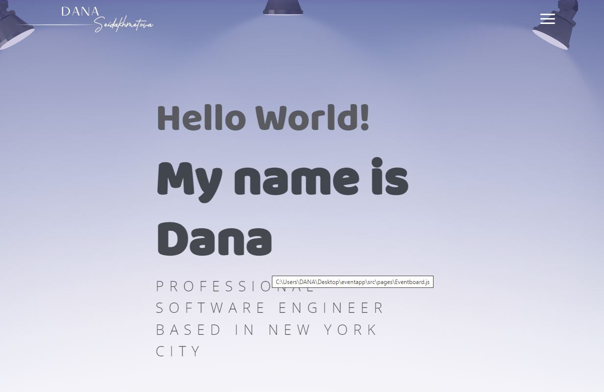

# Prof_Portfolio

<p align="center">
  <kbd>
</img>
  </kbd>
</p>

## Intro
A portfolio is a compilation of materials that exemplifies your beliefs, skills, qualifications, education, training, and experiences. It provides insight into your personality and work ethic. A portfolio website is generally a static website featuring work samples and other details as explained above. It is closely related to Online Resume or C.V.

## Portfolio Sections
✔️ About me
✔️ Skills
✔️ Education
✔️ Achievements And Certifications 🏆
✔️ Projects Connected with GitHub
✔️ Big Projects
✔️ Contact me

To view demo, **[click here](https://dana-seidakhmetova.netlify.app/)**.


## Getting Started

These instructions will get you a copy of the project up and running on your local machine for development and testing purposes.

You'll need [Git](https://git-scm.com) and [Node.js](https://nodejs.org/en/download/) (which comes with [npm](http://npmjs.com)) installed on your computer or use [Docker](https://www.docker.com/products/docker-desktop).

```
node@v10.16.0 or higher
npm@6.9.0 or higher
git@2.17.1 or higher
```

## How To Use 

From your command line, clone and run Prof_Portfolio:

```bash
# Clone this repository
git clone https://github.com/dseydahmetova/Prof_Portfolio.git

# Go into the repository
cd Prof_Portfolio

# Install dependencies
npm install

# Start a local dev server
npm start
```